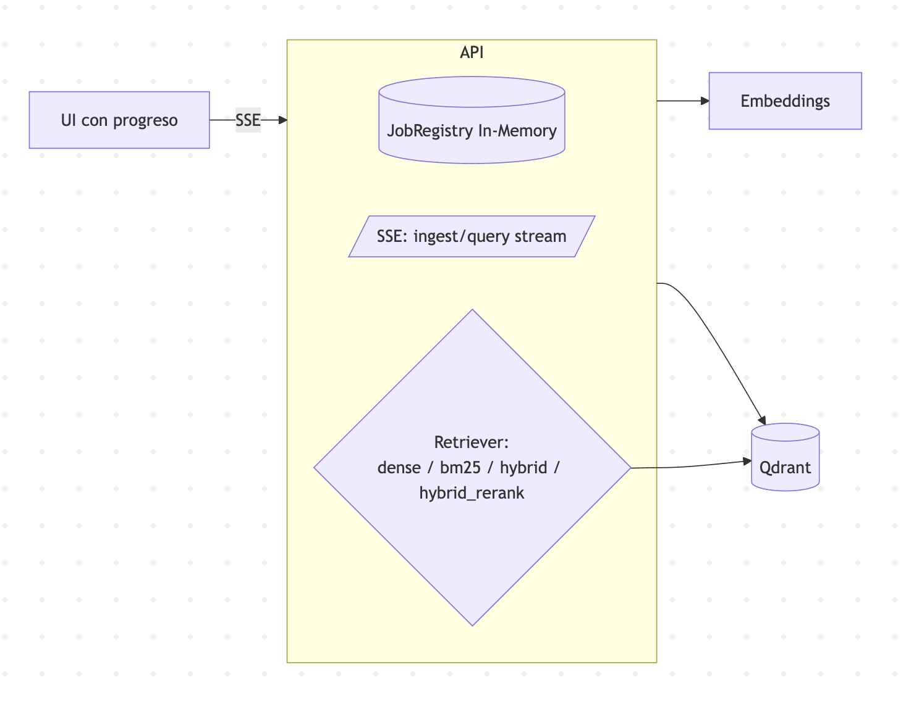

# RAG Microservice v0.1

A simple Retrieval-Augmented Generation (RAG) microservice built with FastAPI and Qdrant.

## Features

- **Document Ingestion**: Support for text, HTML, and Markdown content via `/ingest`
- **Dense Search**: Vector similarity search using local embeddings
- **Simple Query**: Question answering via `/query` endpoint
- **Health Check**: Basic monitoring via `/health`

## Quick Start

1. **Start the services:**
   ```bash
   make up
   ```

2. **Ingest a document:**
   ```bash
   curl -X POST http://localhost:8000/ingest \
     -H 'Content-Type: application/json' \
     -d '{"content":"Your document content here","document_type":"text"}'
   ```

3. **Query the system:**
   ```bash
   curl -X POST http://localhost:8000/query \
     -H 'Content-Type: application/json' \
     -d '{"question":"What is this document about?"}'
   ```

## API Endpoints

- `GET /` - Root endpoint with service info
- `GET /health` - Health check
- `POST /ingest` - Ingest documents
- `POST /query` - Query documents
- `GET /docs` - Interactive API documentation

## Configuration

Environment variables:
- `QDRANT_URL` - Qdrant server URL (default: http://localhost:6333)
- `COLLECTION_NAME` - Vector collection name (default: docs_v1)
- `EMBEDDING_MODEL` - Sentence transformer model (default: BAAI/bge-m3)

## Architecture

```
FastAPI ← HTTP → Client
   ↓
Qdrant (Vector DB)
   ↓  
Local Embeddings (sentence-transformers)
```



## Development

- **Stop services:** `make down`
- **View logs:** `make logs`  
- **Shell access:** `make shell`
- **Clean up:** `make clean`


## log


## status
- OK


# RAG Microservice v0.2

A Retrieval-Augmented Generation (RAG) microservice with async job processing, Server-Sent Events streaming, and multiple retrieval strategies.

## ✨ New in v0.2

- **Async Jobs**: Document ingestion runs asynchronously with job tracking
- **Server-Sent Events**: Real-time progress streaming for ingest and query
- **Multiple Retrievers**: Choose between dense, BM25, or hybrid search
- **Progress Tracking**: Monitor ingestion progress in real-time

## 🚀 Quick Start

1. **Start the services:**
   ```bash
   docker compose up --build
   ```
2. **Ingest a document (async)**
 ```bash
curl -X POST http://localhost:8000/ingest \
  -H 'Content-Type: application/json' \
  -d '{"content":"Your document content","document_type":"text"}'
  ```
3. **Monitor job progress:**  
```bash
curl http://localhost:8000/ingest/{job_id}/status
curl -N http://localhost:8000/ingest/{job_id}/stream
```
4. **Query with different retrievers:**
```bash
# Dense retrieval (default)
curl -X POST "http://localhost:8000/query?retriever=dense&top_k=5" \
  -H 'Content-Type: application/json' \
  -d '{"question":"What is this about?"}'

# BM25 keyword search
curl -X POST "http://localhost:8000/query?retriever=bm25&top_k=5" \
  -H 'Content-Type: application/json' \
  -d '{"question":"What is this about?"}'

# Hybrid search
curl -X POST "http://localhost:8000/query?retriever=hybrid&top_k=5" \
  -H 'Content-Type: application/json' \
  -d '{"question":"What is this about?"}'
```  
4. **Stream query results:**
```bash
curl -N "http://localhost:8000/query/stream?q=What is this about?&retriever=hybrid"
````
🔧 API Endpoints
Ingestion

POST /ingest - Start async document ingestion
POST /ingest/file - Upload and ingest file
GET /ingest/{job_id}/status - Get job status
GET /ingest/{job_id}/stream - Stream job progress (SSE)

Query

POST /query - Query documents
GET /query/stream - Stream query results (SSE)
GET /query/retrievers - List available retrievers

Retrievers

dense: Semantic similarity using OpenAI embeddings
bm25: Keyword-based search using BM25
hybrid: Combines dense and BM25 with score fusion

Client
  ↓ HTTP/SSE
FastAPI Router
  ↓
Job Manager (in-memory)
  ↓
Retrieval Strategies
  ├── Dense (OpenAI/Qdrant)
  ├── BM25 (in-memory)
  └── Hybrid (fusion)
  ↓
Vector Store (Qdrant) + BM25 Index