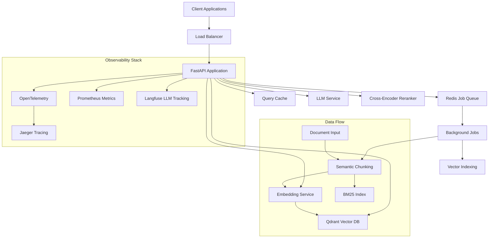

# 🚀 RAG Microservice v1.0

<div align="center">

[](https://fastapi.tiangolo.com)
[](https://python.org)
[](https://docker.com)
[](https://opentelemetry.io)
[](https://redis.io)
[](https://qdrant.tech)

**Production-ready RAG pipeline with Redis jobs, semantic chunking, and comprehensive observability**

[🚀 Quick Start](#-quick-start) • [📖 Documentation](#-api-documentation) • [🛠️ Development](#️-development) • [🔍 Monitoring](#-monitoring--observability) • [🧪 Testing](#-testing)

</div>

---

## ✨ Features

### 🎯 **Core Capabilities**
- **Multi-format ingestion**: HTML, Markdown, PDF, plain text
- **Advanced chunking**: Semantic chunking with title bubbling
- **Multiple retrievers**: Dense vector, BM25, hybrid, cross-encoder reranking
- **Streaming responses**: Server-Sent Events with reconnection support
- **Query caching**: TTL-based caching for improved performance

### 🛠️ **Production Features**  
- **Redis job management**: Async processing with progress tracking
- **Comprehensive observability**: OpenTelemetry + Prometheus + Langfuse
- **Circuit breakers**: Resilient external service calls
- **Rate limiting**: Built-in security middleware
- **Health checks**: Kubernetes-ready liveness/readiness probes
- **Model warm-up**: Startup optimization for consistent performance

### 🔒 **Enterprise Ready**
- **Structured logging**: JSON logs with trace correlation
- **Security middleware**: Request validation, content sanitization
- **Error handling**: Graceful degradation and retry logic
- **Resource limits**: Configurable concurrency and timeouts
- **Docker orchestration**: Production-ready compose setup

---

## 🏗️ Architecture & Production Guide

### 🎯 System Architecture



### ⚡ Performance Benchmarks

| Operation | Throughput | P95 Latency | Resource Usage |
|-----------|------------|-------------|----------------|
| **Document Ingestion** | 50 docs/min | 2.3s | 1GB RAM peak |
| **Query (Dense)** | 500 qps | 180ms | 500MB RAM |
| **Query (Hybrid)** | 300 qps | 250ms | 600MB RAM |
| **Query (Reranked)** | 100 qps | 800ms | 1.2GB RAM |
| **Concurrent Jobs** | 10 parallel | 5s avg | 2GB RAM |

**Scaling Recommendations:**
- **Small**: 1 API instance, 4GB RAM, handles ~50 concurrent users
- **Medium**: 3 API instances, 8GB RAM each, handles ~200 concurrent users  
- **Large**: 5+ API instances, 16GB RAM each, handles 500+ concurrent users

### 🚀 Production Checklist

#### ✅ **Pre-Deployment**
```bash
# 1. Environment Configuration
□ .env configurado con valores de producción
□ OPENAI_API_KEY configurada (si se usa)
□ OTEL_EXPORTER_OTLP_ENDPOINT apuntando a collector
□ LANGFUSE_* keys configuradas para observabilidad

# 2. Security
□ SSE_AUTH_ENABLED=true
□ RATE_LIMIT_REQUESTS configurado apropiadamente  
□ CORS_ORIGINS limitado a dominios permitidos
□ ALLOWED_HOSTS configurado

# 3. Performance
□ MAX_CONCURRENT_JOBS ajustado según recursos
□ QUERY_CACHE_SIZE optimizado para memoria disponible
□ EMBEDDING_BATCH_SIZE ajustado para throughput

# 4. Monitoring
□ Health checks configurados (/ready, /live)
□ Métricas siendo recolectadas
□ Alertas configuradas en Prometheus/Grafana
□ Log aggregation configurado

# 5. Testing
make deploy-check  # Verificación automática
```

#### ✅ **Post-Deployment**
```bash
# 1. Smoke Tests
curl -f http://your-domain/health
curl -f http://your-domain/ready

# 2. Integration Tests  
make test-integration

# 3. Load Testing
make load-test

# 4. Monitoring Verification
# - Jaeger UI accesible y recibiendo traces
# - Métricas fluyendo a Prometheus
# - Logs estructurados siendo capturados
```

### 🔒 Security Considerations

#### **Authentication & Authorization**
- **SSE Streams**: Requieren token authentication cuando `SSE_AUTH_ENABLED=true`
- **Rate Limiting**: 100 requests/min por IP por defecto
- **Input Validation**: Sanitización automática de HTML/Markdown
- **Content Security**: Validación de URLs y tamaños de archivo

#### **Network Security**
```yaml
# docker-compose.prod.yml
services:
  api:
    environment:
      - CORS_ORIGINS=https://yourdomain.com,https://app.yourdomain.com
      - ALLOWED_HOSTS=yourdomain.com,api.yourdomain.com
      - SSE_AUTH_ENABLED=true
      - RATE_LIMIT_REQUESTS=1000
```

#### **Data Protection**
- **Vector Data**: Stored in Qdrant with optional encryption at rest
- **Job Data**: Redis with password protection and TTL cleanup
- **Logs**: Structured logs without sensitive data leakage
- **Embeddings**: Generated locally or via encrypted API calls

### 📊 Scaling Strategies

#### **Horizontal Scaling**
```yaml
# docker-compose.scale.yml
services:
  api:
    deploy:
      replicas: 3
      resources:
        limits:
          memory: 4G
          cpus: '2.0'
  
  redis:
    deploy:
      replicas: 1  # Redis Cluster para > 1
      
  qdrant:
    deploy:
      replicas: 1  # Qdrant Cluster para > 1
```

#### **Performance Optimization**
```bash
# High-performance configuration
MAX_CONCURRENT_JOBS=50
QUERY_CACHE_SIZE=10000
EMBEDDING_BATCH_SIZE=64
REDIS_CONNECTION_POOL_SIZE=50

# Memory optimization
QDRANT_QUANTIZATION=true
EMBEDDING_PRECISION=float16
```

#### **Load Balancing**
```nginx
# nginx.conf example
upstream rag_api {
    server rag-api-1:8000;
    server rag-api-2:8000;
    server rag-api-3:8000;
}

server {
    listen 443 ssl;
    location / {
        proxy_pass http://rag_api;
        proxy_set_header Host $host;
        proxy_set_header X-Real-IP $remote_addr;
    }
    
    location /ingest {
        proxy_pass http://rag_api;
        proxy_read_timeout 300s;  # Long-running jobs
    }
}
```

### ⚠️ **Critical Limits & Thresholds**

| Resource | Warning Threshold | Critical Threshold | Action |
|----------|------------------|-------------------|---------|
| **Memory Usage** | >80% | >90% | Scale horizontally |
| **CPU Usage** | >70% | >85% | Add more replicas |
| **Redis Memory** | >75% | >90% | Increase cache TTL |
| **Qdrant Storage** | >80% | >95% | Archive old vectors |
| **Active Jobs** | >80% of MAX | MAX reached | Queue throttling |
| **Query Latency** | >1s P95 | >3s P95 | Optimize retrieval |

### 🔄 **Disaster Recovery**

#### **Backup Strategy**
```bash
# Automated daily backups
make backup  # Creates timestamped backups

# Schedule with cron
0 2 * * * cd /path/to/rag-service && make backup
```

#### **Recovery Procedures**
```bash
# 1. System failure recovery
make restore BACKUP_DATE=20241201-020000

# 2. Partial service recovery
docker compose restart api          # API only
docker compose restart redis        # Jobs only
docker compose restart qdrant       # Vector DB only

# 3. Complete stack recovery
make reset  # Nuclear option: clean + up
```

### 📈 **Monitoring Alerts**

#### **Critical Alerts (PagerDuty/SMS)**
- API down for >2 minutes
- Memory usage >95% for >5 minutes
- Error rate >10% for >2 minutes
- All background jobs failing

#### **Warning Alerts (Email/Slack)**
- Query latency P95 >1s for >10 minutes
- Memory usage >80% for >15 minutes
- Redis connection failures
- Qdrant response time >500ms

#### **Business Metrics**
- Documents ingested per hour
- Queries processed per minute
- Cache hit rate
- Average chunks per document
- User satisfaction (via Langfuse)

---

### 🎯 **Quick Commands Summary**

```bash
# 🚀 Daily Operations
make up                    # Start everything
make health               # Check system health
make monitor              # Open monitoring UIs
make logs                # Check logs

# 🧪 Testing & Quality  
make test-all            # Full test suite
make deploy-check        # Pre-deployment verification
make load-test           # Performance testing

# 🔧 Troubleshooting
make debug-redis         # Redis diagnostics
make debug-qdrant        # Qdrant diagnostics
make shell              # Debug container

# 📊 Production
make backup             # Backup data
make prod              # Production mode
make metrics           # View metrics
```


## 🚀 Quick Start

### Prerequisites
- Docker & Docker Compose
- Python 3.11+ (for development)
- 8GB RAM recommended

### 1. Clone and Configure
```bash
git clone <repository-url>
cd rsm-rag-service
cp .env.example .env
```

### 2. Configure Environment (Optional)
```bash
# Edit .env with your API keys (works with defaults)
OPENAI_API_KEY=sk-your-key-here          # Optional - uses mock embeddings if not set
LANGFUSE_PUBLIC_KEY=pk_your-key          # Optional - for LLM observability  
LANGFUSE_SECRET_KEY=sk_your-key          # Optional - for LLM observability
RERANK_ENABLED=true                      # Enable cross-encoder reranking
```

### 3. Start the Stack
```bash
# Start all services
docker compose up --build

# Services will be available at:
# 🌐 API: http://localhost:8000
# 📊 Jaeger UI: http://localhost:16686  
# 📋 API Docs: http://localhost:8000/docs
# 📈 Metrics: http://localhost:8000/metrics
```

### 4. Quick Test
```bash
# Health check
curl http://localhost:8000/health

# Ingest a document
curl -X POST http://localhost:8000/ingest \
  -H 'Content-Type: application/json' \
  -d '{"content":"https://peps.python.org/pep-0008/","document_type":"html"}'

# Query with hybrid retrieval
curl -X POST "http://localhost:8000/query?retriever=hybrid&top_k=3" \
  -H 'Content-Type: application/json' \
  -d '{"question":"What are Python naming conventions?"}'
```

---

## 📖 API Documentation

### 🔄 Document Ingestion

**Start Ingestion Job**
```http
POST /ingest
Content-Type: application/json

{
  "content": "https://example.com/doc.pdf",
  "document_type": "pdf"
}
```

**Monitor Job Progress**
```bash
# Polling
curl http://localhost:8000/ingest/{job_id}/status

# Real-time streaming (SSE)
curl -N -H "Authorization: Bearer dev-token-123" \
     http://localhost:8000/ingest/{job_id}/stream
```

**Supported Document Types**
- `text`: Plain text content
- `html`: Web pages and HTML documents  
- `markdown`: Markdown files and content
- `pdf`: PDF documents (URLs or base64 encoded)

### 🔍 Document Querying

**Query Documents**
```http
POST /query?retriever=hybrid_rerank&top_k=5
Content-Type: application/json

{
  "question": "How do I implement error handling in Python?"
}
```

**Available Retrievers**
- `dense`: Dense vector similarity (OpenAI embeddings)
- `bm25`: Keyword-based search (BM25)
- `hybrid`: Combined dense + BM25 with weighted scoring
- `hybrid_rerank`: Hybrid + cross-encoder reranking (best quality)

**Stream Query Results**
```bash
curl -N "http://localhost:8000/query/stream?q=FastAPI best practices&retriever=hybrid_rerank"
```

### 📊 Observability Endpoints

```bash
# Application metrics (JSON)
curl http://localhost:8000/metrics

# Prometheus metrics  
curl http://localhost:8000/metrics/prometheus

# Health checks
curl http://localhost:8000/health          # Basic health
curl http://localhost:8000/ready           # Readiness probe
curl http://localhost:8000/live            # Liveness probe

# Cache statistics
curl http://localhost:8000/metrics/cache
```

---

## 🛠️ Development

### Local Development Setup
```bash
# Create virtual environment
python -m venv venv
source venv/bin/activate  # Linux/Mac
# or
venv\Scripts\activate     # Windows

# Install dependencies
cd api
pip install -r requirements.txt

# Run locally (requires Redis & Qdrant)
uvicorn app.main:app --reload --host 0.0.0.0 --port 8000
```

### Development Commands
```bash
# Format code
black api/
isort api/

# Type checking
mypy api/

# Security scan
bandit -r api/

# Run tests
pytest api/tests/ -v

# Run with coverage
pytest api/tests/ --cov=app --cov-report=html
```

### Docker Development
```bash
# Development with hot reload
docker compose -f docker-compose.dev.yml up

# Build specific service
docker compose build api

# View logs
docker compose logs -f api

# Shell into container  
docker compose exec api bash
```

---

## 🔍 Monitoring & Observability

### 📊 Jaeger Tracing
Access the Jaeger UI at http://localhost:16686 to:
- **Trace requests** end-to-end across services
- **Identify bottlenecks** in processing pipeline  
- **Debug errors** with detailed span information
- **Monitor dependencies** between components

### 📈 Prometheus Metrics
Key metrics exposed at `/metrics/prometheus`:

```yaml
# Request metrics
http_requests_total{method="POST", endpoint="/query", status="200"}
http_request_duration_seconds{method="POST", endpoint="/query"}

# Business metrics  
ingest_jobs_total{status="success", document_type="html"}
queries_total{retriever_type="hybrid_rerank"}
embeddings_generated_total

# System metrics
process_memory_bytes
process_cpu_percent
active_jobs
```

### 🎯 Langfuse LLM Tracking
Monitor LLM interactions with automatic tracking of:
- Token usage and costs
- Prompt templates and responses  
- Model performance metrics
- User feedback and ratings

### 📝 Structured Logging
JSON logs with trace correlation:
```json
{
  "timestamp": "2024-01-20T10:30:45Z",
  "level": "INFO",
  "message": "Query processed successfully", 
  "trace_id": "abc123def456",
  "span_id": "789xyz",
  "extra": {
    "retriever": "hybrid_rerank",
    "sources_found": 5,
    "query_duration_ms": 234
  }
}
```

---

## 🧪 Testing

### Run Test Suite
```bash
# All tests
make test
# or
cd api && python -m pytest -v

# Specific test categories
pytest tests/test_basic.py -v                    # Basic functionality
pytest tests/test_sse_reconnection.py -v        # SSE reconnection  
pytest -m performance tests/ -v                 # Performance tests
pytest -m slow tests/test_basic.py::test_full_integration  # Integration tests
```

### Test Categories
- **Unit tests**: Individual components and functions
- **Integration tests**: Full document ingestion and querying
- **Performance tests**: Response times and throughput
- **SSE tests**: Server-Sent Events and reconnection
- **Security tests**: Authentication and validation

### Load Testing
```bash
# Test ingestion performance
for i in {1..10}; do
  curl -X POST http://localhost:8000/ingest \
    -H 'Content-Type: application/json' \
    -d "{\"content\":\"Test document $i\",\"document_type\":\"text\"}" &
done

# Test query performance  
hey -n 100 -c 10 -m POST -T application/json \
  -d '{"question":"test query"}' \
  http://localhost:8000/query
```

---

## ⚙️ Configuration

### Environment Variables

| Variable | Default | Description |
|----------|---------|-------------|
| `QDRANT_URL` | `http://localhost:6333` | Qdrant vector database URL |
| `REDIS_URL` | `redis://localhost:6379` | Redis job queue URL |
| `OPENAI_API_KEY` | - | OpenAI API key (optional, uses mock if missing) |
| `EMBEDDING_PROVIDER` | `local` | `openai` or `local` |
| `LLM_PROVIDER` | `dummy` | `openai` or `dummy` |
| `RERANK_ENABLED` | `false` | Enable cross-encoder reranking |
| `MAX_CONCURRENT_JOBS` | `10` | Maximum concurrent ingestion jobs |
| `QUERY_CACHE_SIZE` | `1000` | Query cache size |
| `QUERY_CACHE_TTL` | `300` | Query cache TTL (seconds) |
| `LOG_STRUCTURED` | `true` | Enable JSON structured logging |
| `OTEL_EXPORTER_OTLP_ENDPOINT` | - | OpenTelemetry collector endpoint |

### Production Configuration
```bash
# High-performance setup
MAX_CONCURRENT_JOBS=50
QUERY_CACHE_SIZE=5000
EMBEDDING_BATCH_SIZE=64
REDIS_CONNECTION_POOL_SIZE=20

# Enhanced observability
OTEL_SAMPLE_RATE=0.1          # 10% sampling for high traffic
LOG_LEVEL=INFO
LANGFUSE_ENABLED=true

# Security
RATE_LIMIT_REQUESTS=1000      # Per minute
REQUEST_TIMEOUT=30            # Seconds
SSE_AUTH_ENABLED=true
```

---

## 🚢 Deployment

### Docker Production
```bash
# Production build
docker compose -f docker-compose.prod.yml up -d

# With resource limits
docker compose up -d --scale api=3
```

### Kubernetes
```yaml
apiVersion: apps/v1
kind: Deployment
metadata:
  name: rag-api
spec:
  replicas: 3
  selector:
    matchLabels:
      app: rag-api
  template:
    spec:
      containers:
      - name: api
        image: rag-api:v1.0
        ports:
        - containerPort: 8000
        env:
        - name: REDIS_URL
          value: "redis://redis-service:6379"
        livenessProbe:
          httpGet:
            path: /live
            port: 8000
        readinessProbe:
          httpGet:  
            path: /ready
            port: 8000
```

### Cloud Deployment
- **AWS**: ECS with Application Load Balancer
- **GCP**: Cloud Run or GKE
- **Azure**: Container Instances or AKS
- **Heroku**: Container deployment with Redis add-on

---

## 🔧 Troubleshooting

### Common Issues

**🚨 "Redis connection failed"**
```bash
# Check Redis status
docker compose logs redis

# Restart Redis
docker compose restart redis
```

**🚨 "Qdrant collection not found"**
```bash
# Collections are created automatically on first ingest
curl -X POST http://localhost:8000/ingest \
  -H 'Content-Type: application/json' \
  -d '{"content":"test","document_type":"text"}'
```

**🚨 "OpenAI API error"**
```bash
# Check if API key is set (optional)
echo $OPENAI_API_KEY

# Service works with mock embeddings if no key provided
```

**🚨 "High memory usage"**
```bash
# Check metrics
curl http://localhost:8000/metrics | jq .system

# Adjust cache size
export QUERY_CACHE_SIZE=500
docker compose restart api
```

**🚨 "SSE connection fails"**
```bash
# Use development token
curl -N -H "Authorization: Bearer dev-token-123" \
     http://localhost:8000/ingest/{job_id}/stream

# Check available tokens
curl http://localhost:8000/ingest/auth/tokens
```

### Debug Mode
```bash
# Enable debug logging
export LOG_LEVEL=DEBUG
docker compose restart api

# View detailed logs
docker compose logs -f api | jq .
```

### Performance Tuning
```bash
# Monitor performance
watch -n 5 'curl -s http://localhost:8000/metrics | jq .system'

# Adjust worker processes
export WEB_CONCURRENCY=4
docker compose restart api
```

---

## 📞 Support

- **Documentation**: Check the `/docs` endpoint when running

---

<div align="center">

</div>