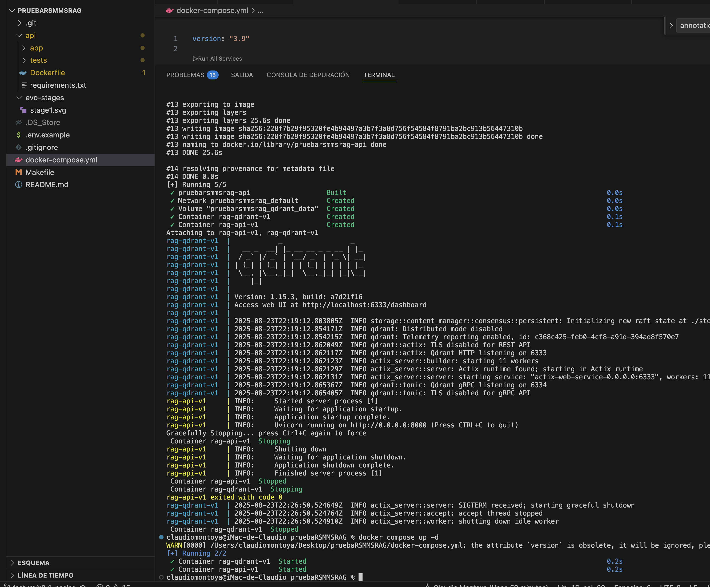
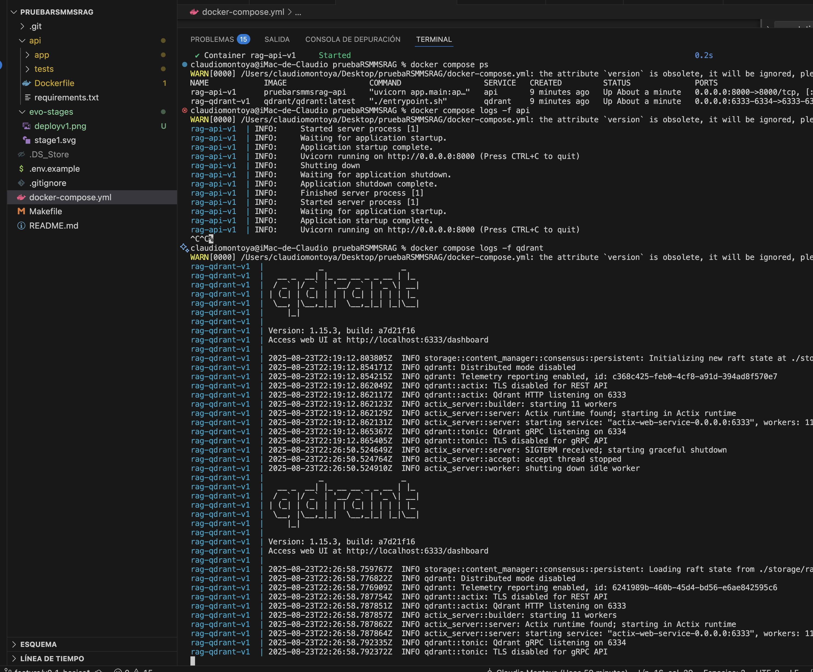
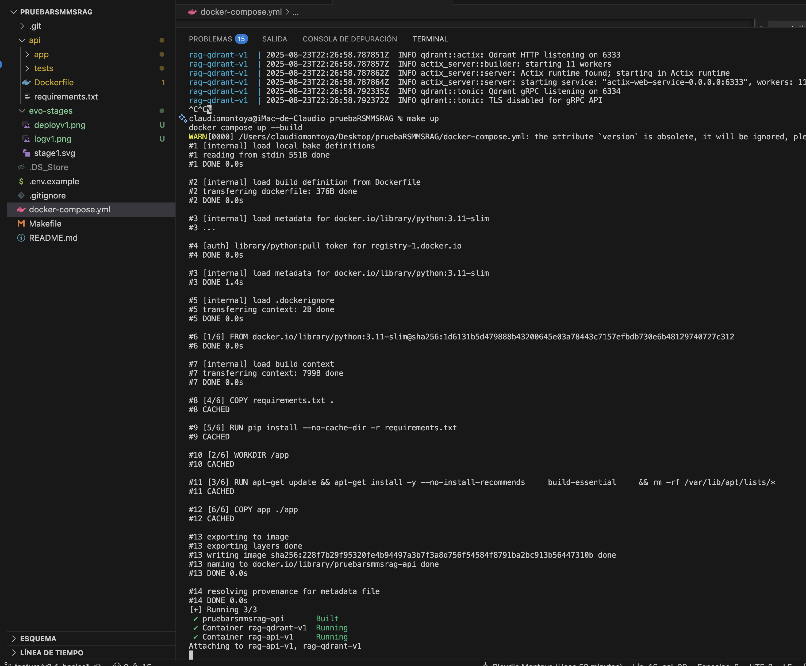
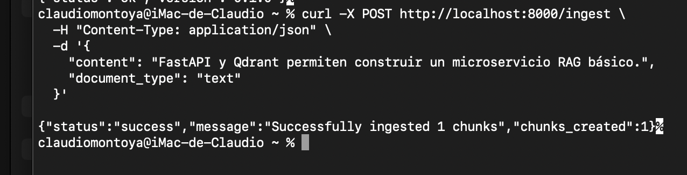

# RAG Microservice v0.1

A simple Retrieval-Augmented Generation (RAG) microservice built with FastAPI and Qdrant.

## Features

- **Document Ingestion**: Support for text, HTML, and Markdown content via `/ingest`
- **Dense Search**: Vector similarity search using local embeddings
- **Simple Query**: Question answering via `/query` endpoint
- **Health Check**: Basic monitoring via `/health`

## Quick Start

1. **Start the services:**
   ```bash
   make up
   ```

2. **Ingest a document:**
   ```bash
   curl -X POST http://localhost:8000/ingest \
     -H 'Content-Type: application/json' \
     -d '{"content":"Your document content here","document_type":"text"}'
   ```

3. **Query the system:**
   ```bash
   curl -X POST http://localhost:8000/query \
     -H 'Content-Type: application/json' \
     -d '{"question":"What is this document about?"}'
   ```

## API Endpoints

- `GET /` - Root endpoint with service info
- `GET /health` - Health check
- `POST /ingest` - Ingest documents
- `POST /query` - Query documents
- `GET /docs` - Interactive API documentation

## Configuration

Environment variables:
- `QDRANT_URL` - Qdrant server URL (default: http://localhost:6333)
- `COLLECTION_NAME` - Vector collection name (default: docs_v1)
- `EMBEDDING_MODEL` - Sentence transformer model (default: BAAI/bge-m3)

## Architecture

```
FastAPI ← HTTP → Client
   ↓
Qdrant (Vector DB)
   ↓  
Local Embeddings (sentence-transformers)
```


## Development

- **Stop services:** `make down`
- **View logs:** `make logs`  
- **Shell access:** `make shell`
- **Clean up:** `make clean`


## log






## status
- OK