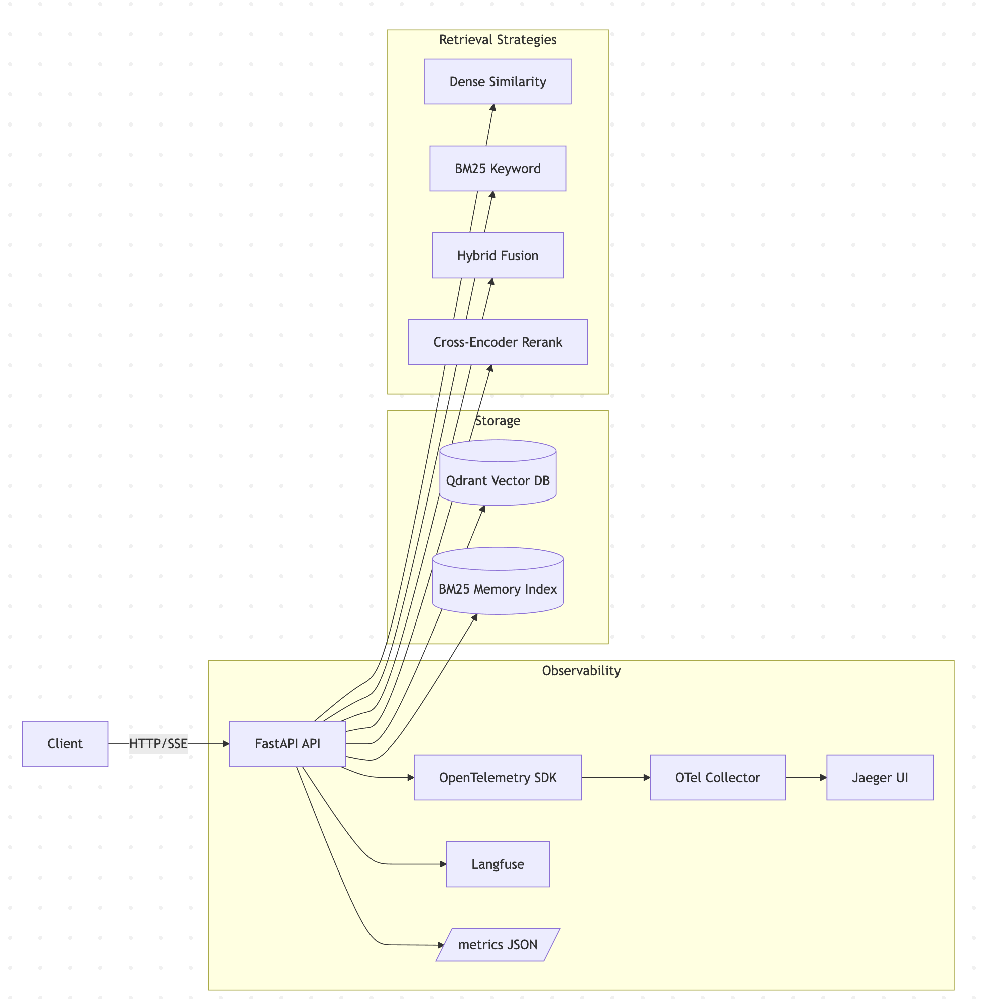

# RAG Microservice v0.3

A production-ready Retrieval-Augmented Generation (RAG) microservice with comprehensive observability, async job processing, Server-Sent Events streaming, and advanced retrieval strategies.

## ✨ New in v0.3

- **🔍 OpenTelemetry Tracing**: Distributed tracing with Jaeger UI
- **📊 Langfuse Integration**: LLM call tracking and observability  
- **📈 Comprehensive Metrics**: JSON endpoint with system monitoring
- **📝 Structured Logging**: Correlation with trace IDs and span IDs
- **🎯 Cross-Encoder Reranking**: Advanced relevance scoring
- **⚡ Enhanced Performance**: Optimized with observability insights

## 🏗️ Architecture


# NEW


## 🚀 Quick Start

1. **Configure environment:**
   ```bash
   cp .env.example .env
   # Edit .env with your API keys
   ```

2. **Start the full observability stack:**
   ```bash
   docker compose up --build
   ```

3. **Access services:**
   - **API**: http://localhost:8000
   - **Jaeger UI**: http://localhost:16686  
   - **API Docs**: http://localhost:8000/docs
   - **Metrics**: http://localhost:8000/metrics

## 📊 Observability Features

### **Distributed Tracing (Jaeger)**
- End-to-end request tracing
- Service dependency mapping
- Performance bottleneck identification
- Error root cause analysis

### **LLM Observability (Langfuse)**
```python
# Automatic LLM call tracking
with trace_with_langfuse("embedding_generation") as ctx:
    embeddings = embed_texts(chunks)
```

### **Metrics Collection**
```bash
curl http://localhost:8000/metrics
```
```json
{
  "counters": {
    "http_requests_total": {"GET /query": 150},
    "ingest_jobs_completed": 45
  },
  "histograms": {
    "http_request_duration_ms": {
      "count": 150, "mean": 245.5, "p95": 890.2
    }
  },
  "system": {
    "cpu_percent": 15.2,
    "memory_percent": 45.8
  }
}
```

### **Structured Logging**
```json
{
  "timestamp": "2024-01-20T10:30:45Z",
  "level": "INFO", 
  "message": "Query processed successfully",
  "trace_id": "abc123def456...",
  "span_id": "789xyz...",
  "extra": {
    "retriever": "hybrid_rerank",
    "sources_found": 5,
    "query_duration_ms": 234
  }
}
```

## 🔍 Retrieval Strategies

### **1. Dense Vector Search**
```bash
curl -X POST "http://localhost:8000/query?retriever=dense&top_k=5" \
  -H 'Content-Type: application/json' \
  -d '{"question":"What is machine learning?"}'
```

### **2. BM25 Keyword Search** 
```bash
curl -X POST "http://localhost:8000/query?retriever=bm25&top_k=5" \
  -H 'Content-Type: application/json' \
  -d '{"question":"machine learning algorithms"}'
```

### **3. Hybrid Search (Dense + BM25)**
```bash
curl -X POST "http://localhost:8000/query?retriever=hybrid&top_k=5" \
  -H 'Content-Type: application/json' \
  -d '{"question":"AI and machine learning"}'
```

### **4. Reranked Search (with Cross-Encoder)**
```bash
# Enable reranking in .env: RERANK_ENABLED=true
curl -X POST "http://localhost:8000/query?retriever=hybrid_rerank&top_k=5" \
  -H 'Content-Type: application/json' \
  -d '{"question":"advanced AI techniques"}'
```

## 📡 Async Ingestion with Progress Tracking

### **Start Ingestion Job**
```bash
RESPONSE=$(curl -X POST http://localhost:8000/ingest \
  -H 'Content-Type: application/json' \
  -d '{"content":"https://example.com/document.html","document_type":"html"}')

JOB_ID=$(echo $RESPONSE | jq -r '.job_id')
```

### **Monitor Progress (Polling)**
```bash
curl http://localhost:8000/ingest/$JOB_ID/status
```

### **Stream Progress (SSE)**
```bash
curl -N http://localhost:8000/ingest/$JOB_ID/stream
```

### **JavaScript SSE Example**
```javascript
const eventSource = new EventSource(`/ingest/${jobId}/stream`);

eventSource.onmessage = (event) => {
  const data = JSON.parse(event.data);
  console.log(`Job ${data.job_id}: ${data.stage} - ${data.progress}%`);
  
  if (data.status === 'success') {
    console.log(`✅ Ingested ${data.chunks_created} chunks`);
    eventSource.close();
  }
};
```

## 🌊 Query Streaming

```bash
# Stream query results in real-time
curl -N "http://localhost:8000/query/stream?q=What is FastAPI?&retriever=hybrid_rerank&top_k=3"
```

```javascript
const queryStream = new EventSource('/query/stream?q=FastAPI&retriever=hybrid');

queryStream.onmessage = (event) => {
  const data = JSON.parse(event.data);
  
  switch(data.type) {
    case 'search_start':
      console.log('🔍 Starting search...');
      break;
    case 'search_results': 
      console.log(`📄 Found ${data.results_count} sources`);
      break;
    case 'generation_chunk':
      document.getElementById('answer').innerHTML += data.chunk;
      break;
    case 'generation_complete':
      console.log('✅ Answer complete');
      break;
  }
};
```

## ⚙️ Configuration

### **Environment Variables**
```env
# Vector Database
QDRANT_URL=http://localhost:6333
COLLECTION_NAME=docs_v3

# Embeddings
EMBEDDING_PROVIDER=openai  # or 'local'
EMBEDDING_MODEL=text-embedding-3-small
OPENAI_API_KEY=sk-your-key-here

# OpenTelemetry Tracing
OTEL_EXPORTER_OTLP_ENDPOINT=http://localhost:4318
OTEL_SERVICE_NAME=rag-microservice-v3
OTEL_SAMPLE_RATE=1.0

# Langfuse (optional)
LANGFUSE_PUBLIC_KEY=pk_your_key
LANGFUSE_SECRET_KEY=sk_your_key
LANGFUSE_HOST=https://cloud.langfuse.com

# Reranking
RERANK_ENABLED=true
RERANK_MODEL=BAAI/bge-reranker-v2-m3

# Logging
LOG_STRUCTURED=true
LOG_LEVEL=INFO
```

## 📈 Performance Monitoring

### **Query Performance Dashboard**
Access Jaeger UI at http://localhost:16686 to analyze:
- Request latencies by retriever type
- Embedding generation times
- Database query performance
- Error rates and patterns

### **System Metrics**
```bash
# Get comprehensive metrics
curl http://localhost:8000/metrics | jq .

# Quick health check
curl http://localhost:8000/metrics/health
```

### **Log Analysis**
```bash
# Filter logs by trace ID
docker compose logs api | grep "abc123def456"

# Monitor error patterns
docker compose logs api | grep '"level":"ERROR"'
```

## 🧪 Testing & Development

### **Health Checks**
```bash
# Application health
curl http://localhost:8000/health

# Metrics system health  
curl http://localhost:8000/metrics/health

# Service dependencies
curl http://localhost:6333/collections  # Qdrant
curl http://localhost:16686/api/traces  # Jaeger
```

### **Load Testing**
```bash
# Test ingestion performance
for i in {1..10}; do
  curl -X POST http://localhost:8000/ingest \
    -H 'Content-Type: application/json' \
    -d "{\"content\":\"Test document $i\",\"document_type\":\"text\"}" &
done

# Test query performance
for i in {1..50}; do
  curl -X POST "http://localhost:8000/query?retriever=hybrid" \
    -H 'Content-Type: application/json' \
    -d '{"question":"test query"}' &
done
```

## 🔧 Troubleshooting

### **Common Issues**

**Tracing not appearing in Jaeger:**
```bash
# Check OTel Collector logs
docker compose logs otel-collector

# Verify endpoint configuration
curl http://localhost:4318/v1/traces
```

**High memory usage:**
```bash
# Check metrics for memory patterns
curl http://localhost:8000/metrics | jq .system.memory_percent

# Adjust OTel batch settings in otel-collector-config.yaml
```

**Slow queries:**
```bash
# Analyze spans in Jaeger UI
# Check retrieval strategy performance
curl -X POST "http://localhost:8000/query?retriever=dense" \
  -H 'Content-Type: application/json' \
  -d '{"question":"test"}' -w "%{time_total}"
```

## 🔜 Coming in v1.0

- **Redis Job Backend**: Persistent, scalable job management
- **Prometheus Metrics**: `/metrics/prometheus` endpoint
- **Advanced Chunking**: Semantic and hierarchical splitting
- **Health Monitoring**: `/ready` endpoint with dependency checks
- **Auto-scaling**: Horizontal pod autoscaling based on metrics

## 📚 API Reference

Full interactive documentation available at http://localhost:8000/docs

### **Key Endpoints**
- `POST /ingest` - Start document ingestion
- `GET /ingest/{job_id}/status` - Check job status  
- `GET /ingest/{job_id}/stream` - Stream job progress
- `POST /query` - Query documents
- `GET /query/stream` - Stream query results
- `GET /metrics` - Application metrics
- `GET /health` - Service health check

---

**Built with ❤️ using FastAPI, OpenTelemetry, Qdrant, and modern observability practices.**